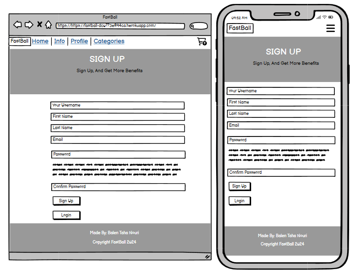
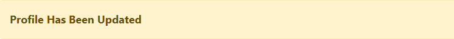
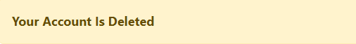
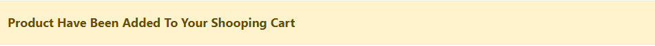

# FastBall

This website is a football e-commerce site. The users can find footballs of the best quality, users can also create an account and make an order from the website. Users can also categorize on the page so they can find the brand of the footballs they want.

The live site can be viewed [here](https://fastball-dc0773e894ca.herokuapp.com/)

## Contents

## Project Goals

- I wanted to create a website that allows the admin/staff to add/delete/change product and handle the user account easy on the admin panel and that is linked to a database.

- I wanted to allow the admin/staff to see an admin link on the navbar when they are logged in, where they can add, update and delete products.

- I wanted to allow the admin/staff to be able to put products on sale price so they sell out the old stuff easy.

- I wanted to allow the users to create an account and be able to change the their account details.

- I wanted to allow users to be able to categorize on the page so they can find the brands they want easier.

## User Experience

### User Stories

#### Epics 

During the planning for the project, I started and created 4 epics and then broke them down into 38 user stories.

The user stories that were broken down from the epics, I labeled them with different labels and I used the MoSCoW (must have, should have, could have and won't have) to develop them. I labeled them, so I could put energy on the important ones before I started with the non-important ones. You can se all of them on the project board [here.](https://github.com/users/balennouri/projects/5/views1) On the project board you will be able to see the future features as well.

Below here is the completed user stories for this version of this project listed by epics:

##### Epic: Initial Django Setup

* As a developer I want to set up Django and install the initial supporting libraries needed so that I can begin development of the site.

* As a developer I want to set up the environment to secure secret configuration variables so that I can ensure sensitive data is kept private.

* As a developer I want to deploy the site to Heroku so that I can ensure the site works in a production environment and share the completed site publicly.

##### Epic: User Authentication and Account Management

* As a first time user, I can create an account so that I can place an order and comment on products.

* As a user I can delete my account.

* As a returning user I can login/logout of my account.

* As returning user I can update my profile information.

* As site owner I can see all the detail information for the users in the admin panel.

##### Epic: Product Management and Cart/Checkout

* As a admin I can add/delete/update products on the admin panel and on the website.

* As a admin I can add new categories on the admin panel.

* As a user I can add products to the cart.

* As a user I can update the quantity of the product in the cart and delete the product from the cart.

* As user I can place an order and checkout.

* When a user or admin place a order the cart becomes empty.

##### Epic: The Webiste and Content:

* As a user I will have it easy to navigate on the page.

* As a user I will be able to see the rules and info for the store.

* As a user I will be able to categorize the brand of the balls.

### Site Structure

#### Wireframes

I used Balsamiq to create my wireframes. I decided to make wireframes for larger screens and for mobile phones. I think wireframes are a good thing to do before starting with the project, so I can put my ideas on what I want the website to look like. Some pages are a little different from the wireframes, but it small details differ from page to page. The reason is because, during development, to make a website with good functionality.

##### Home page in wireframe

##### Info page in wireframe

##### Category page in wireframe

##### Your Profile page in wireframe

##### Sign Up page in wireframe

##### Login page in wireframe

##### Product Management page in wireframe

##### Add Product page in wireframe

##### Update Product page in wireframe

##### Shopping cart page in wireframe

#### Database Schema

For this project, I utilized the built-in Django User Model for user accounts and created one model in the store app. In the store model, I built a customer model, order model, product model and category model.

The database schema seen below was created using [Drawsql.app.](https://drawsql.app/) All the fields are not labeled correctly because of limitations in the "drawsql" app. One are the email field and the cloudinary field. However, the diagram still shows the general layout of the models in the store app.

If you want to see the true field choices, head over to the models.py in the store app.

The Database schema:

### Design Choices

#### Typography

The fonts used for this project came with the start bootsrap theme, and are the roboto, Helvetica Neue and sans-serif as a secondary font.

#### Colour Palette

The color palette image was generated from [coolers.](https://coolors.co/) The colors came with the bootsrap I chose from [Start Bootstrap.](https://startbootstrap.com/)

- The white color is the main color for the website.

- The color of the fonts on the website is black or dark gray.

- The header and footer have light dark gray colors.

- All the buttons on the website are styled with bootstrap and the colors are chosen from the attribute they have.

### Project Management

I used agile methodology throughout the development of this project utilizing GitHub projects and issues. You can read more about this in the AGILE.md file [here.](https://github.com/balennouri/pp4/blob/main/AGILE.md)

## Features

### Existing Features

#### The Landing page And General Site  Content

* ##### The Navigation Bar

The site navbar when user comes in to the page:

The site navbar when user is logged in:

The site navbar when admin is logged in:

* ##### The Main Content

Admin/Staff: Product Management

Messages staff users see when they do something on the product management page:

Home page:

View Product page:

Info page:

Category page:

Account pages:

Messages users see if they do some changes for their account:

Cart page:

Messages users see when they add/delete or update something in the cart:

* ##### The Footer

#### User Accounts

#### Background Features

### Future Features

## Technologies Used
* [Balsamiq](https://balsamiq.com/wireframes/)
    * Used to create the wireframes during the planning stage of the project.
* [HTML5](https://html.spec.whatwg.org/)
    * Used to create structure and content for the site.
* [CSS](https://www.w3.org/Style/CSS/Overview.en.html)
    * Used to add custom styles to the HTML.
* [Django](https://www.djangoproject.com/)
    * The python framework used to develop the site.
* [Bootstrap](https://getbootstrap.com/)
    * The CSS framework used to develop the site.
* [Python](https://en.wikipedia.org/wiki/Python_(programming_language))
    * Used to provide functionality to the site.
* [JavaScript](https://www.javascript.com/)
    * Used to enhance functionality and interactivity.
* [Cloudinary](https://cloudinary.com/)
    * Used to host media files.
* [ElephantSQL](https://www.elephantsql.com/)
    * Used to host the database used for the site in production.
* [Gitpod](https://www.gitpod.io/#get-started)
    * Used to create code/content and file structure for the respository.
* [GitHub](https://github.com/)
    * Used to store the repository.

[Back to top](#contents)

## Testing

## Deployment and Development
* The project was developed using [Gitpod](https://www.gitpod.io/#get-started) to create the code and overall file structure.
* The repository for this project is hosted on [GitHub](https://github.com/).

### Deployment
The project was deployed using [Heroku](https://id.heroku.com/login).

NB - to ensure a successful deployment of the project in Heroku, you need to ensure that you create a Procfile and a requirements.txt file.

Once you are certain that everything is ready to deploy the repo, you can do so through the following steps.

1. Log in to Heroku or create an account if necessary.
2. Click on the button labeled "New" from the dashboard in the top right corner and select the "Create new app" option in the drop-down menu.
3. Enter a unique name for the application and select the region you are in.
    * For this project, the unique name is "FastBall" and the region selected is Europe.
4. Click on "create app".
5. Navigate to the settings tab and click "Reveal config vars".
6. Add the config vars necessary for the project.
7. Navigate to the "Deploy" section by clicking the "Deploy" tab in the navbar.
8. Select "GitHub" as the deployment method and click "Connect to GitHub".
9. Search for the GitHub repository that you wish to deploy.
10. Click on "connect" to link the repository to Heroku.
11. Scroll down and click on "Deploy Branch" to manually deploy.
12. Once the app has deployed successfully, Heroku will notify you and provide a button to view the app.

NB - If you wish to rebuild the deployed app automatically every time you push to GitHub, you may click on "Enable Automatic Deploys" in Heroku.

### Forking the Repository
To create a copy of the repository for viewing and editing without affecting the original repository you can fork the repository through the following steps:

1. In the "FastBall" repository, click on the "fork" tab in the top right corner.
2. Click on "create fork" to fork the repository in your own GitHub account.

### Cloning The Repository
To clone the repository through GitHub, follow these steps:

1. In the repository, select the "code" tab located just above the list of files and next to the gitpod button.
2. Select "HTTPS" in the dropdown menu.
3. Copy the URL under HTTPS.
4. Open Git Bash in your IDE of choice.
5. Change the working directory to the location where you want the cloned directory to be created.
6. Type "git clone" and paste the URL that was copied from the repository.
7. Press the "enter" key to create the clone.

### The ElephantSQL Database
The [ElephantSQL](https://www.elephantsql.com/) PostgreSQL Database was used for this project.

To set up a database, follow these steps:

1. Sign up or log in to ElephantSQL with your GitHub account.
2. Click on "Create New Instance".
3. Enter a name for the instance (this is usually the name of the project.)
4. Select "Tiny Turtle (Free)" free plan.
5. The "Tags" field can be left blank.
6. Click "Select Region".
7. Select a data center near you.
8. Click "Review".
9. Ensure that all details are correct and then click "Create instance".
10. Once created, you can return to the dashboard and click on the instance created to view relevant details such as the database URL and password.

### The Cloudinary API
[Cloudinary](https://cloudinary.com/) is used in this project to store media assets. This is done due to the fact that Heroku does not store media files reliably.

## Credits

To style the page and the content to Read me:

- The screenshot at the top of the ReadMe was built from [Ami Responsive.](https://ui.dev/amiresponsive)

To write the code for this project:

- [Code institute LMS](https://learn.codeinstitute.net/dashboard)
- [W3Schools](https://www.w3schools.com/)
- [MDN Web Docs](https://developer.mozilla.org/en-US/)
- [Coding 4 You](http://www.coding4you.at/inf_tag/beginners_python_cheat_sheet.pdf)

## Acknowledgements

This site was developed as my Fourth portfolio project for the Code Institute course in Full Stack Software Development. I would like to thank my mentor David Bowers, the slack community and the Code Institute team.